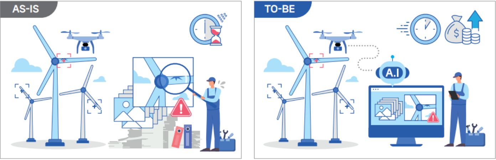

# **풍력발전기 블레이드 결함 탐지 솔루션 개발**

| 항목             | 내용              |
|------------------|-----------------|
| 프로젝트 기간     | 2022.11 – 2024.06  |
| 참여 인원        | 4명                |
|🛠️ Model | [YOLOv7](https://github.com/WongKinYiu/yolov7) |
| Annotation        | [Instance Segmentation]()    |
| Annotation Tool   | [Labelme.py](https://github.com/wkentaro/labelme)              |

### 프로젝트 개요
```
자율주행 드론으로 촬영한 풍력발전기 블레이드 사진들에서 균열을 Instance Segmentation 방식으로 태깅하여 이미지 객체 탐지 모델을 만드는 프로젝트
```

### Dataset Information
```bash
dataset/
├── train/
│   ├── images/*.jpg
│   └── labels/*.txt
├── validation/
│   ├── images/*.jpg
│   └── labels/*.txt
├── test/
│   ├── images/*.jpg
│   └── labels/*.txt
└── data/
    └──yolov7.yaml
```

### Class Information
```
현장성을 반영하기 위해 풍력발전기 점검 엔지니어의 자문을 받아 라벨링 클래스 기준을 수립
1. 클래스는 위험도 수준을 의미
2. 클래스 속성 선별 기준은 수리(Repair) 규모에 따라 나열
3. 같은 속성이라도 결함 진행량에 따라 위험도를 다르게 구분
```
| Class | 1                | 2               | 3               | 4                | 5                 |
|-------|------------------|-----------------|-----------------|------------------|-------------------|
|attribute| Contamination    | Erosion-1       | Cracks-2        | Erosion-2        | Damage-2          |
|       |                  |                 |  Damage-1       |                  |  Lightning Stroke |
---

### 이미지 리사이징
```
이미지가 고해상도·고용량인 관계로 모델이 이미지를 가져오는 과정에서 메모리 부족 이슈가 발생 가능성 높음
이에 모델 리사이징과 별개로 리사이징을 진행하기로 결정
각 케이스별로 리사이징 조건을 설정하고, 최적의 리사이징 크기를 도출하기 위해 DoE(실험 설계) 접근법을 적용
```

### 모델 선정


## 📌 Pain Point & 개선 방안
> 
> ### Pain Point 1: 대용량 고해상도 이미지 데이터 처리 어려움
> - 48MP 고해상도 이미지로 인해 데이터 처리 및 저장이 무거웠음  
> - 라벨링 작업에 소요되는 시간과 검수 부담이 큼
> 
>> **해결 방법**  
>> - 최적화된 이미지 리사이징 (0.5~0.8배, 0.75배 최종 선정) 및 정방형 크기로 데이터 경량화  
>> - Instance Segmentation 방식 채택으로 결함 특성 세분화 및 라벨링 품질 향상  
>> - 외부 인력과 엔지니어의 3회 검수 및 피드백 체계 구축

> ### Pain Point 2: 일부 결함 신뢰도 저하 및 결함 예측 데이터 부재
> - 다발성 결함 탐지 시 신뢰도가 낮음  
> - SCADA 로그 데이터 권한 문제로 결함 발생 예측에 어려움 존재
> 
>> **해결 방법**  
>> - ‘다발성 결함’ 카테고리 신설로 기준 명확화  
>> - SCADA 데이터 협조 불가에 따라 이미지 기반 탐지 솔루션 고도화에 집중  
>> - YOLOv7-seg 모델 기반 하이퍼파라미터 튜닝 및 이미지 증강 적용

> ### Pain Point 3: 비라벨링 이미지 데이터 활용 및 데이터 분할 문제
> - 라벨링 되지 않은 이미지 데이터의 활용 방안 마련 필요  
> - 효율적인 Train-Validation-Test 데이터셋 분할 필요
> 
>> **해결 방법**  
>> - 비라벨링 이미지셋에서 20% 샘플링 활용해 모델 성능 개선 시도  
>> - 각 호기 및 파트별로 균등하게 샘플링하여 데이터셋 분할 (8:1.5:0.5)
